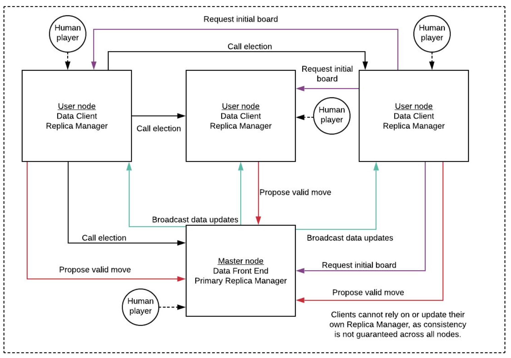
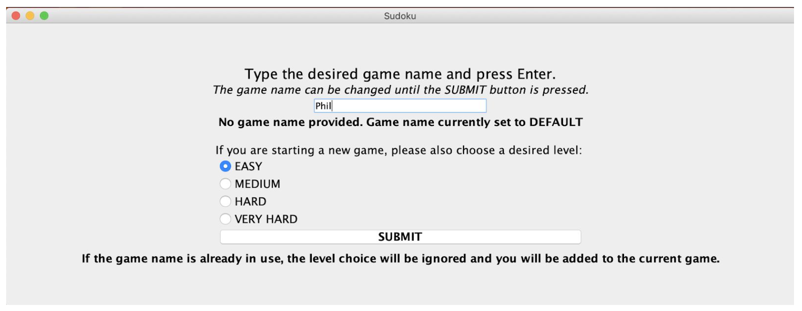
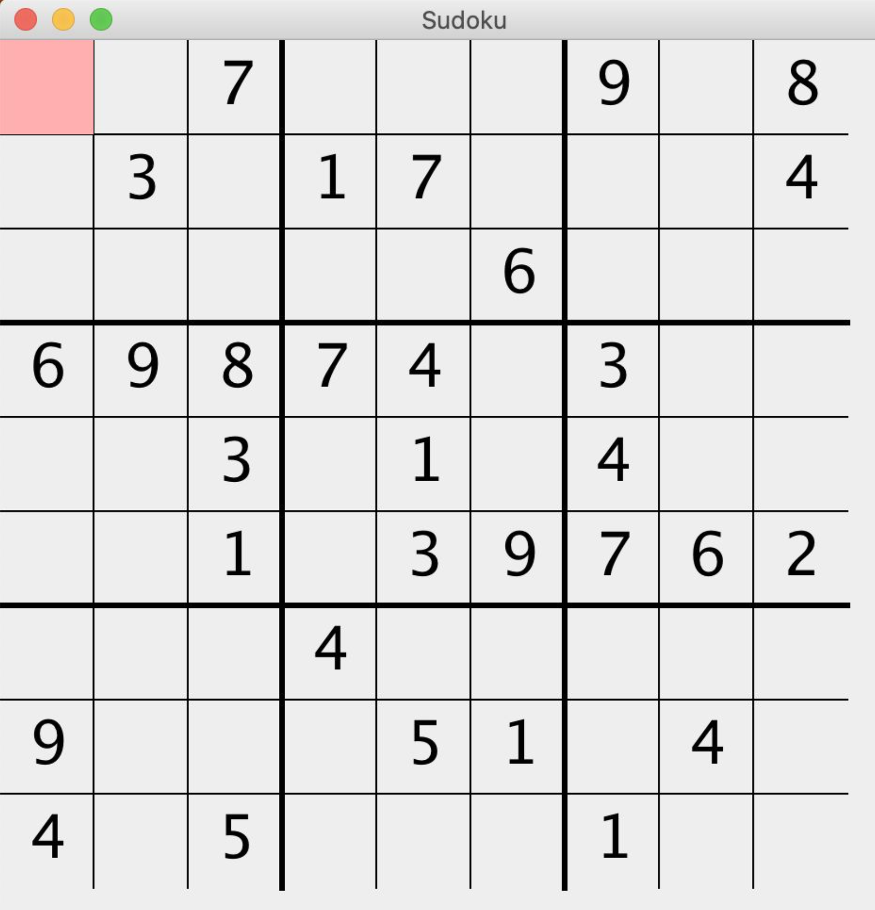

Code author
-----------
Brian Rouse (@brouse12)  
Chandra Davis (@davischandram)  
Phillip (Yichuan) Ma (@yichuanma95)

# Distributed Sudoku
A multiplayer Sudoku game implemented using JGroups and Java Swing.  Any number of players connected via LAN may share a particular board and update cells concurrently.  Consensus on state is determined by a master node, which resolves proposed moves from all players.  All player nodes replicate the master node's data, so a new master node can be designated if the current master crashes or exits the game.

Message flow:


# Execution Steps
```
java -jar sudoku.jar
```
In GUI interface, enter the name of a new game, or the name of an existing game to join.


